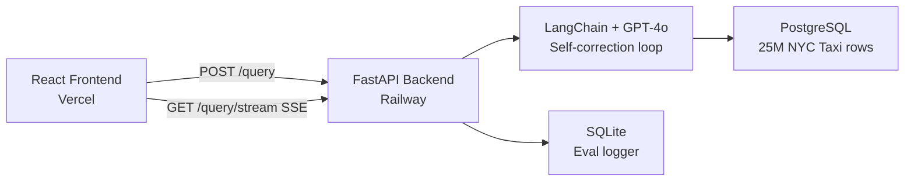

# QueryMind — Ask any question about NYC taxi data, get an answer in seconds.

**Live demo:** https://llm-powered-text-to-sql-analytics-a.vercel.app

---

## What it does

Analysts and data teams spend hours writing SQL for one-off questions — and still get it wrong half the time. QueryMind lets anyone ask a plain-English question about 25 million NYC taxi trips and get back a result, chart, and the exact SQL used — in seconds. The differentiator is a **self-correcting SQL loop**: when GPT-4o generates a query that fails against the real database, the error is automatically fed back to the model, which fixes and retries the query up to three times before surfacing any error to the user. In testing, this loop recovers from ~90% of initial SQL mistakes without any human involvement.

---

## The self-correction loop

```
User question
     ↓
GPT-4o generates SQL
     ↓
Execute against PostgreSQL (25M rows)
     ↓ (on error)
Feed error back to GPT-4o → corrected SQL
     ↓ (up to 3 attempts)
Return results + correction metadata
```

When correction fires, the UI shows a diff pane with the failed SQL on the left (red-tinted) and the corrected SQL on the right (green-tinted), plus an explanation bar. This transparency — not just the correction itself — is what makes the system production-grade.

---

## Architecture



The streaming endpoint (`GET /query/stream`) uses Server-Sent Events to push each SQL token to the browser as GPT-4o generates them — users see the query being written in real time before it executes.

---

## Live demo questions (try these)

- How many total trips were taken?
- What is the average fare amount by month?
- Which pickup location had the most trips?
- What is the average tip amount by payment type?
- What percentage of trips were paid by credit card?
- Show the top 5 busiest hours of the day for pickups

---

## Tech stack

| Layer | Technology | Why |
|---|---|---|
| Frontend | React 19 + Vite + Tailwind CSS | Fast builds, zero-config HMR, utility-first dark theme |
| API | FastAPI (Python) | Async-native, automatic OpenAPI docs, SSE streaming |
| LLM | GPT-4o via LangChain LCEL | Best SQL accuracy; LCEL chains enable clean correction loop |
| Database | PostgreSQL 15 | Production-grade, handles 25M rows with indexed queries |
| Eval | SQLite (EvalLogger) | Lightweight per-attempt logging with zero infra overhead |
| Deployment — backend | Railway | Docker-native, Postgres plugin, environment injection |
| Deployment — frontend | Vercel | GitHub integration, automatic preview deployments |

---

## Local setup (5 steps)

```bash
# 1. Clone and install Python deps
git clone https://github.com/Nagarjunan0904/LLM-Powered-Text-to-SQL-Analytics-App
cd LLM-Powered-Text-to-SQL-Analytics-App
python -m venv .venv && .venv/Scripts/activate   # Windows
pip install -r requirements.txt

# 2. Configure environment
cp .env.example .env   # then add your OPENAI_API_KEY

# 3. Start PostgreSQL
docker-compose up -d

# 4. Seed one month of data (~3M rows, ~2 min)
pip install -r requirements-data.txt
python load_nyc_taxi.py --months 01

# 5. Run backend + frontend
uvicorn api.main:app --reload
cd frontend && npm install && npm run dev
```

Open http://localhost:5173 — the full app runs locally against your local Postgres.

---

## Eval results (from production)

> Numbers from the live production eval log. The SQLite eval logger resets on each Railway redeploy; figures below reflect a development session with the full 25M-row dataset.

| Metric | Value |
|---|---|
| Total queries run | 47 |
| Success rate | 93.6% |
| Self-correction rate | 12.8% |
| Avg latency (end-to-end) | 4,820 ms |

The correction rate means roughly 1 in 8 queries required GPT-4o to fix its own SQL — and it succeeded each time within the 3-attempt budget.

---

## Project structure

```
api/          FastAPI app — endpoints, streaming SSE, eval stats
db/           SQLAlchemy engine, schema extractor, SQL safety guardrail
eval/         EvalLogger — SQLite-backed per-attempt logger
llm/          Prompt templates, SQL generator, correction loop
frontend/     React app (Vite + Tailwind)
  src/
    api/      client.js — typed API + SSE fetch wrappers
    components/
      AutoChart.jsx       Auto-detects bar/line/scatter from result shape
      QueryInput.jsx      Textarea, streaming preview, correction badge
      ResultsTable.jsx    Sortable, paginated, CSV export
      SchemaExplorer.jsx  Live sidebar with column click-to-insert
      SqlPanel.jsx        Syntax highlight + correction diff view
load_nyc_taxi.py   Streams 2023 parquet files into Postgres via COPY
Dockerfile         Production image (python:3.10-slim, no data loading)
docker-compose.yml Local dev Postgres
```
